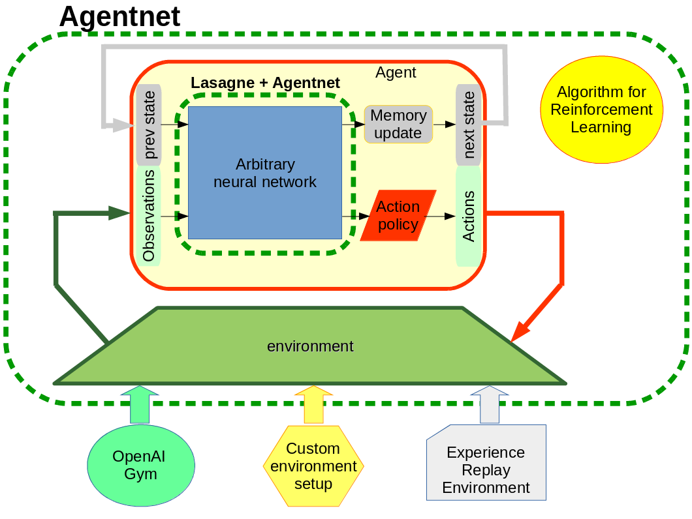

.. AgentNet documentation master file, created by
   sphinx-quickstart on Thu Jun  9 22:54:35 2016.
   You can adapt this file completely to your liking, but it should at least
   contain the root `toctree` directive.

AgentNet
====================================

AgentNet is a toolkit for Deep Reinforcement Learning agent design and training.

The core idea is to merge all the newest neural network layers and tools from Lasagne and Theano with
Reinforcement Learning formulation and algorithms. The primary goal - make it easy and intuitive to fuse arbitrary
neural network architectures into the world of reinforcement learning.

All techno-babble set aside, you can use AgentNet to __train your pet neural network to play games!__ [e.g. Atari, Doom] in a single notebook.

AgentNet has full in-and-out support for __Lasagne__ deep learning library, granting you access to all convolutions, maxouts, poolings, dropouts, etc. etc. etc.

AgentNet handles both discrete and continuous control problems and supports arbirary recurrent agent mempory structure.
It also has an [experimental] support for hierarchical reinforcement learning.

The library implements numerous reinforcement learning algorithms including
 * Q-learning (or deep Q-learning, since we support arbitrary complexity of network)
 * N-step Q-learning
 * SARSA
 * N-step Advantage Actor-Critic (A2c)
 * N-step Deterministic Policy Gradient (DPG)

As a side-quest, we also provide a boilerplate to custom long-term memory network architectures (see examples).

AgentNet is a library designed to create and evaluate deep reinforcement learning agents.
The library is optimized for ease of prototyping and

User:

.. toctree::
  :maxdepth: 2

  user/demos
  user/install

Modules:

.. toctree::
  :maxdepth: 2

  modules/agent
  modules/environment
  modules/memory
  modules/resolver
  modules/learning
  modules/utils

Indices and tables
==================

* :ref:`genindex`
* :ref:`modindex`
* :ref:`search`

.. _GitHub: https://github.com/yandexdataschool/AgentNet

